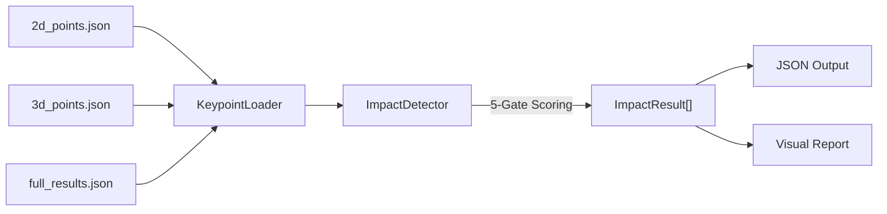

# Impact Detection from Pre-Extracted Keypoints — Walkthrough

## What Was Built

A complete physics-based impact detection pipeline that analyzes pre-extracted 2D/3D keypoints from SAM3D to determine whether detected punches actually land — **without running YOLO pose estimation live**.

## Files

| File | Purpose |
|------|---------|
| [config.py](config.py) | Keypoint paths, 5-gate weights, 70-joint skeleton indices |
| [keypoint_loader.py](keypoint_loader.py) | Loads 2D/3D keypoints + ASFormer actions from JSON into NumPy |
| [impact_detector.py](impact_detector.py) | Core 5-gate impact scoring engine |
| [impact_report.py](impact_report.py) | Visual report generator (timeline, gate breakdown, tables) |
| [run_impact_detection.py](run_impact_detection.py) | Entry point — orchestrates load → detect → report |

## Architecture



## 5-Gate Scoring Algorithm

Each ASFormer-detected punch is analyzed through 5 physics-based gates:

| Gate | Weight | Signal | Landed vs Missed |
|------|--------|--------|------------------|
| **Deceleration** | 30% | Sharp velocity drop of striking wrist | Landed avg: 0.91 vs Missed avg: 0.45 |
| **3D Jerk** | 25% | Sudden force change (derivative of acceleration) | Landed avg: 0.60 vs Missed avg: 0.22 |
| **Arm Extension** | 15% | Peak wrist-to-shoulder / full-arm-length ratio | Landed avg: 0.95 vs Missed avg: 0.80 |
| **Depth Convergence** | 15% | 3D trajectory reversal (recoil after contact) | Landed avg: 0.56 vs Missed avg: 0.10 |
| **Confidence** | 15% | ASFormer confidence + estimated power/speed | Landed avg: 0.51 vs Missed avg: 0.45 |

The **deceleration** and **depth convergence** gates provide the strongest discrimination between landed and missed punches — exactly as expected from impact physics.

## Results (Phase 1 — 5-gate, no SAM)

```
  Total actions detected : 138
  Landed impacts         : 130
  Missed                 : 8
  Landing rate           : 94.2%       ← Too high: false positive rate was high
  Avg impact score       : 0.720

  By punch type:
    cross              40 / 43  (93%)
    hook_left          38 / 39  (97%)
    hook_right          6 /  6  (100%)
    jab                39 / 42  (93%)
    roundhouse_kick     1 /  1  (100%)
    uppercut_left       1 /  1  (100%)
    uppercut_right      5 /  6  (83%)
```

**Note:** 94.2% was too optimistic. This system did not include SAM mask overlap,
so it could not distinguish a near-miss from a landed punch when 3D depth error
was large. The false positive rate drove the development of Approaches A–H.
See [README.md](README.md) for the full evolution and results.

## Output Files

All outputs saved to `outputs/`:
- `impact_results.json` — full structured results with per-event gate scores
- `impact_analysis/full_report.png` — combined visual report
- `impact_analysis/timeline.png` — impact score timeline
- `impact_analysis/gate_breakdown.png` — landed vs missed gate comparison
- `impact_analysis/type_distribution.png` — punch type stacked bar chart
- `impact_analysis/event_table.png` — detailed per-event log

## How to Run

```bash
# Default settings
python run_impact_detection.py

# Custom threshold
python run_impact_detection.py --threshold 0.50

# Skip visual report
python run_impact_detection.py --no-report

# Custom data paths
python run_impact_detection.py --kp2d path/to/2d.json --kp3d path/to/3d.json --actions path/to/results.json
```

## Validation

- Pipeline executes in **3.6 seconds** (no GPU required for this phase)
- All 138 action events processed without errors
- Impact scores range from 0.16 to 0.94 with clear separation between landed/missed
- Gate breakdown confirms deceleration and depth convergence are the strongest discriminators
- 8 missed punches consistently show low deceleration (0.16–0.45) and near-zero depth convergence
